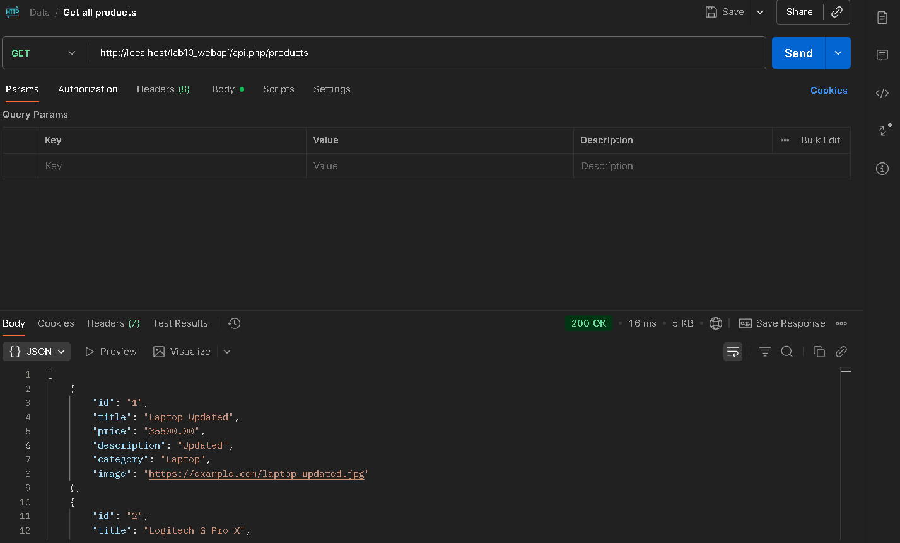
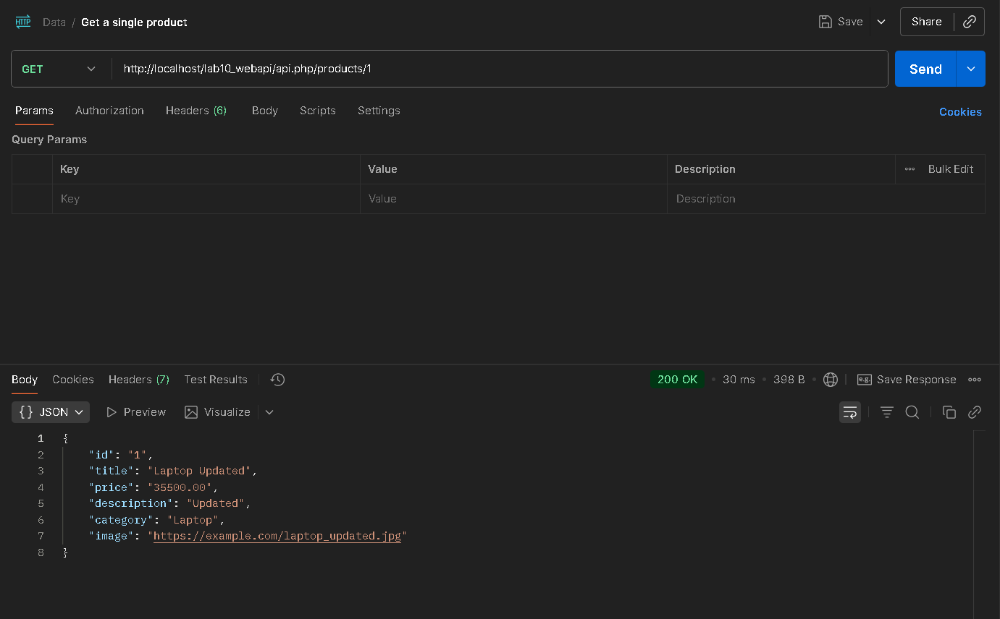
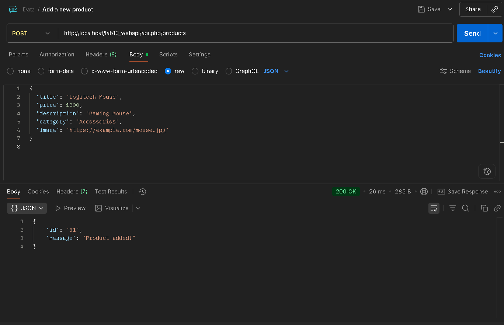
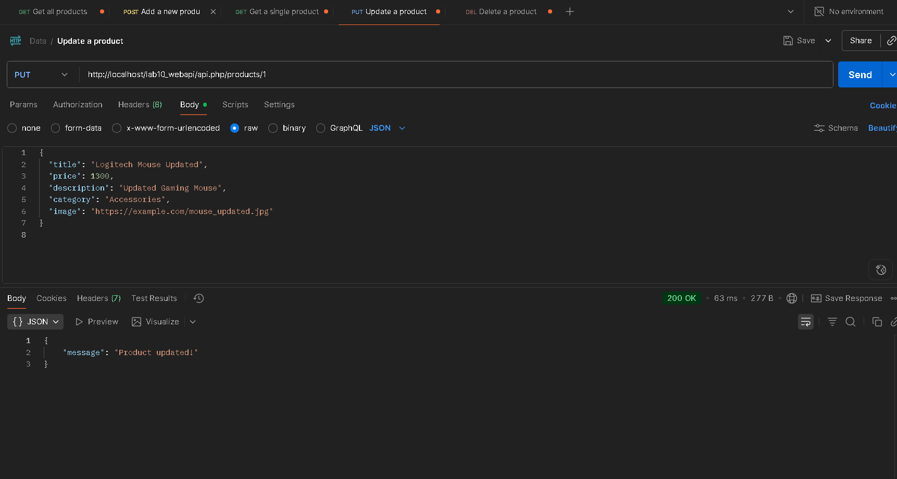
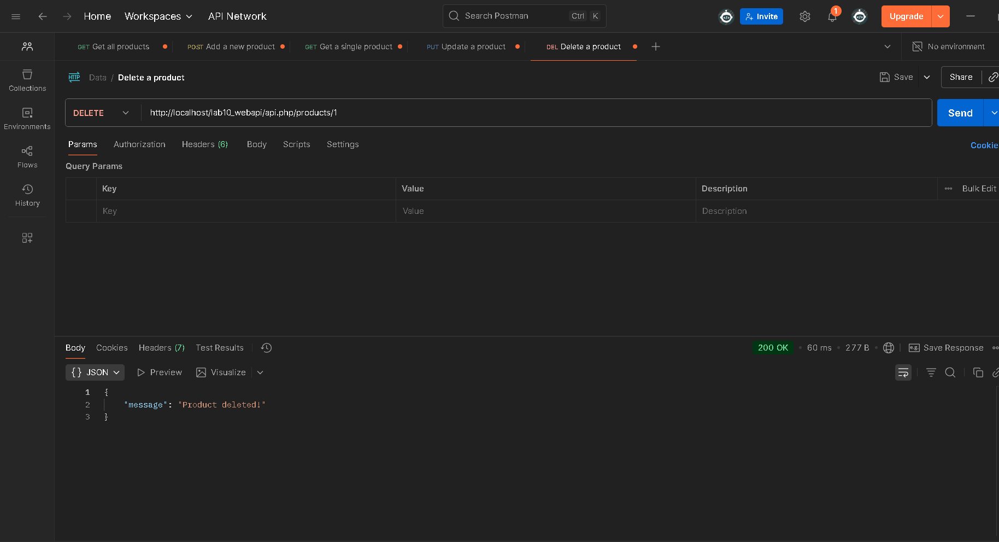

# Lab10 Web API - Nan Store

## รายละเอียด
- สร้างฐานข้อมูล MySQL ชื่อ `nan_store`
- ตาราง `products` เก็บข้อมูลสินค้า
- สร้าง Web API ด้วย PHP/XAMPP
- รองรับ CRUD สำหรับสินค้า (Products)
- ข้อมูลทั้งหมดเป็น JSON format

## โครงสร้างไฟล์
lab10_webapi/
├── api.php
├── db.php
├── lab10_webapi.sql
├── README.md
├── get-all-products.png
├── get-single-product.png
├── add-new-product.png
├── update-product.png
└── delete-product.png

## การเรียกใช้งาน API
- Base URL: `http://localhost/lab10_webapi/api.php`

| สัญลักษณ์ | Method | URL | Body (JSON) | คำอธิบาย |
|------------|--------|-----|------------|-----------|
| 🛒 | GET | `/products` | - | ดูสินค้าทั้งหมด |
| 🔍 | GET | `/products/{id}` | - | ดูสินค้าเฉพาะ ID |
| ➕ | POST | `/products` | {"title":"Mouse","price":2500,"description":"Gaming Mouse","category":"Accessories","image":"https://example.com/mouse.jpg"} | เพิ่มสินค้า |
| ✏️ | PUT | `/products/{id}` | {"title":"Laptop Updated","price":35500,"description":"Updated","category":"Laptop","image":"https://example.com/laptop_updated.jpg"} | แก้ไขสินค้า |
| 🗑️ | DELETE | `/products/{id}` | - | ลบสินค้า ID |

---

## ตัวอย่างเรียก API ด้วย Postman

### 1️⃣ ดูสินค้าทั้งหมด
Method: GET  
URL: `/api.php/products`  



---

### 2️⃣ ดูสินค้าเฉพาะ ID
Method: GET  
URL: `/api.php/products/1`  



---

### 3️⃣ เพิ่มสินค้า
Method: POST  
URL: `/api.php/products`  
Body (JSON):
```json
{
  "title": "Logitech Mouse",
  "price": 1200,
  "description": "Gaming Mouse",
  "category": "Accessories",
  "image": "https://example.com/mouse.jpg"
}
```


---

4️⃣ แก้ไขสินค้า
Method: PUT
URL: /api.php/products/1
Body (JSON):

```json
{
  "title": "Logitech Mouse Updated",
  "price": 1300,
  "description": "Updated Gaming Mouse",
  "category": "Accessories",
  "image": "https://example.com/mouse_updated.jpg"
}
```


---

5️⃣ ลบสินค้า
Method: DELETE
URL: /api.php/products/1

